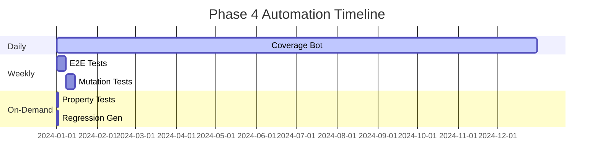

# Phase 4: Advanced Testing & Quality (60% → 75%)

## Overview
Phase 4 focuses on advanced testing techniques and quality improvements to reach 75% coverage while ensuring test effectiveness.

## Timeline
- **Start**: When Phase 3 reaches 60% coverage
- **Duration**: 4-6 weeks (automated)
- **Target**: 75% line coverage + 70% branch coverage

## Key Objectives

### 1. Coverage Enhancements
- ✅ **Branch Coverage**: Track decision paths, not just lines
- ✅ **E2E Testing**: Weekly comprehensive test runs
- 🔄 **Property-based Testing**: Mathematical correctness validation
- 🔄 **Mutation Testing**: Ensure tests actually catch bugs

### 2. Test Quality
- **Mutation Score Target**: <20% mutants survive
- **Test Execution Time**: <5 min for light, <30 min for full
- **Flakiness**: <0.1% failure rate

### 3. Infrastructure
- ✅ **Configurable Targets**: Environment-based thresholds
- ✅ **Cache Optimization**: Google Drive data caching
- 🔄 **Slack Notifications**: Real-time alerts
- 🔄 **Regression Templates**: Auto-generate from failures

## Implementation Status

### ✅ Completed
1. **Environment Variables**
   ```python
   TARGET = float(os.getenv("COV_TARGET", "60"))
   GAIN_MIN = float(os.getenv("COV_GAIN_MIN", "0.5"))
   ```

2. **Branch Coverage**
   - All pytest commands now include `--cov-branch`
   - Coverage XML includes branch data

3. **E2E Workflow**
   - Weekly schedule (Monday 4 AM UTC)
   - Parallel execution with pytest-xdist
   - Separate coverage reports

4. **Cache Optimization**
   - GitHub Actions cache for test data
   - SHA-256 based cache keys

### 🔄 In Progress

#### Property-based Testing
```python
# tests/property/test_features_hypothesis.py
from hypothesis import given, strategies as st

@given(
    prices=st.lists(st.floats(min_value=0.01, max_value=1000000), 
                    min_size=2, max_size=1000)
)
def test_sma_properties(prices):
    """SMA should always be between min and max price."""
    sma = calculate_sma(prices, window=min(len(prices), 20))
    assert min(prices) <= sma <= max(prices)
```

#### Mutation Testing Setup
```yaml
# .github/workflows/mutation.yml
- name: Run mutation tests
  run: |
    pip install mutmut
    mutmut run --paths-to-mutate=src/feature_engineering
    mutmut html
    
- name: Check mutation score
  run: |
    SCORE=$(mutmut results | grep "killed" | awk '{print $2}')
    if [ "$SCORE" -lt 80 ]; then
      echo "❌ Mutation score too low: $SCORE%"
      exit 1
    fi
```

### 📋 TODO

1. **Slack Integration**
   ```python
   # Add to coverage_autofix.py
   def notify_slack(message: str):
       webhook = os.getenv("SLACK_COV_WEBHOOK")
       if webhook:
           requests.post(webhook, json={"text": message})
   ```

2. **Regression Test Generator**
   ```python
   # scripts/generate_regression_test.py
   def create_test_from_failure(traceback: str, test_name: str):
       """Generate test that reproduces the failure."""
       # Parse traceback
       # Extract inputs/state
       # Generate test stub
   ```

3. **Doc-string Testing**
   ```yaml
   # Add to CI
   - name: Test documentation examples
     run: pytest --doctest-modules --doctest-glob="*.md"
   ```

## Metrics & Monitoring

### Coverage Targets
| Metric | Current | Phase 4 Target |
|--------|---------|----------------|
| Line Coverage | 45-60% | 75% |
| Branch Coverage | N/A | 70% |
| Mutation Score | N/A | >80% |
| E2E Tests | 0 | 50+ |

### Quality Gates
- PR must improve coverage by ≥0.5%
- No decrease in branch coverage
- All E2E tests pass weekly
- Mutation testing on critical modules

## Automation Schedule



## Configuration

### GitHub Secrets (Phase 4)
```yaml
COV_TARGET: "75"              # Phase 4 target
COV_GAIN_MIN: "0.3"          # Lower threshold for mature codebase
SLACK_COV_WEBHOOK: "https://..." # Optional notifications
MUTATION_THRESHOLD: "80"      # Minimum kill rate
```

### pytest.ini Updates
```ini
[pytest]
markers =
    heavy: Heavy/slow tests (nightly only)
    e2e: End-to-end tests (weekly only)
    property: Property-based tests
    mutation: Mutation testing targets
```

## Success Criteria

Phase 4 is complete when:
1. **Line coverage ≥75%** sustained for 1 week
2. **Branch coverage ≥70%** 
3. **Mutation score >80%** on critical modules
4. **Zero flaky tests** in CI
5. **E2E suite** covers all major workflows

## Next: Phase 5 (75% → 85%)
- Contract testing
- Performance benchmarks
- Fuzz testing
- Security scanning integration

---

*Phase 4 represents the shift from quantity to quality - not just more tests, but better tests that actually catch bugs.*