# 🤖 Self-Healing Coverage Pipeline

## Overview
A **zero-click** automated system that continuously improves test coverage without human intervention.

## How It Works

```mermaid
graph TD
    A[Daily 3:30 AM UTC] --> B{Coverage < 60%?}
    B -->|Yes| C[Create Branch]
    B -->|No| Z[Exit ✅]
    C --> D[Generate Tests]
    D --> E[Run Coverage]
    E --> F{Improved ≥0.5%?}
    F -->|Yes| G[Update Reports]
    F -->|No| Y[Abort ⚪]
    G --> H[Commit & Push]
    H --> I[Create PR]
    I --> J[Auto-merge if passing]
```



## Components

### 1. Coverage Bot (`scripts/coverage_autofix.py`)
- Checks current coverage against target (60%)
- Creates feature branch automatically
- Runs test generation
- Measures improvement
- Creates PR if meaningful gain

### 2. Google Drive Integration (`scripts/fetch_gdrive_data.sh`)
- Downloads test data from Google Drive
- Verifies integrity with SHA-256
- Caches data to avoid re-downloads
- Extracts archives automatically

### 3. GitHub Actions Workflow (`.github/workflows/coverage-bot.yml`)
- Runs daily at 3:30 AM UTC
- Can be triggered manually
- Handles git configuration
- Optional auto-merge for passing PRs

## Setup Requirements

### 1. GitHub Secrets
Add these in **Settings → Secrets and variables → Actions**:

| Secret | Description |
|--------|-------------|
| `GH_PAT_COVERAGE_BOT` | Personal Access Token with `repo`, `contents`, `pull-requests` permissions |
| `GDRIVE_FILE_ID` | Google Drive file ID for test data (optional) |
| `GDRIVE_SHA256` | SHA-256 checksum of the file (optional) |

### 2. Personal Access Token Creation
1. Go to GitHub Settings → Developer settings → Personal access tokens
2. Click "Generate new token (classic)"
3. Name: `coverage-bot`
4. Select scopes:
   - `repo` (all)
   - `workflow`
5. Copy token and add as `GH_PAT_COVERAGE_BOT` secret

### 3. Google Drive File ID
For a Google Drive link like:
```
https://drive.google.com/file/d/1ABC123XYZ789/view
```
The file ID is: `1ABC123XYZ789`

## Usage

### Automatic (Default)
- Bot runs every night at 3:30 AM UTC
- No human action required
- PRs appear automatically when coverage can be improved

### Manual Trigger
```bash
# Via GitHub UI
Actions → 🤖 Self-Healing Coverage Bot → Run workflow

# Via gh CLI
gh workflow run coverage-bot.yml
```

### Local Testing
```bash
# Test coverage bot locally
python scripts/coverage_autofix.py

# Test Google Drive fetch
GDRIVE_FILE_ID=xxx GDRIVE_SHA256=yyy bash scripts/fetch_gdrive_data.sh
```

## What Happens

### When Coverage < Target
1. **Branch Created**: `feature/auto-coverage-YYYYMMDD`
2. **Tests Generated**: Stub tests for low-coverage modules
3. **Coverage Measured**: Must improve by ≥0.5%
4. **PR Created**: With detailed description and labels
5. **Auto-merge**: If all checks pass (optional)

### When Coverage ≥ Target
- Bot exits quietly
- No branches or PRs created
- Success logged in GitHub Actions

## PR Example

```markdown
## 🤖 Automated Coverage Boost

**Current**: 45.01% → **New**: 47.52% (🔺 +2.51%)

### What this PR does:
- Auto-generated stub tests using `scripts/generate_phase3_tests.py`
- Added tests for modules with <25% coverage
- Improves overall test coverage towards 60% target

### Files changed:
- New test files in `tests/autogenerated/`
- Updated coverage reports and README badges
```

## Monitoring

### GitHub Actions Dashboard
- View runs: Actions → 🤖 Self-Healing Coverage Bot
- Check logs for coverage trends
- Monitor PR creation success

### Coverage Trends
```bash
# View historical coverage
ls -la reports/coverage_report_*.json | tail -10

# Check current coverage
python -c "import json; print(json.load(open('coverage.json'))['totals']['percent_covered'])"
```

## Troubleshooting

### Bot Not Creating PRs
1. Check GitHub Actions logs
2. Verify PAT has correct permissions
3. Ensure coverage improvement ≥0.5%

### Google Drive Fetch Fails
1. Verify `GDRIVE_FILE_ID` is correct
2. Check file is publicly accessible or shared
3. Verify `GDRIVE_SHA256` matches file

### Coverage Not Improving
1. Check if all low-coverage modules have tests
2. Consider adjusting `generate_phase3_tests.py` logic
3. May need manual intervention for complex modules

## Benefits

1. **Zero Human Effort**: Truly hands-off operation
2. **Continuous Improvement**: Coverage trends upward automatically
3. **Quality Gates**: Only creates PRs for meaningful improvements
4. **Transparent**: All changes tracked in git history
5. **Configurable**: Easy to adjust targets and thresholds

---

*The self-healing coverage pipeline ensures your project maintains and improves test coverage automatically, letting developers focus on features while the bot handles test coverage.*